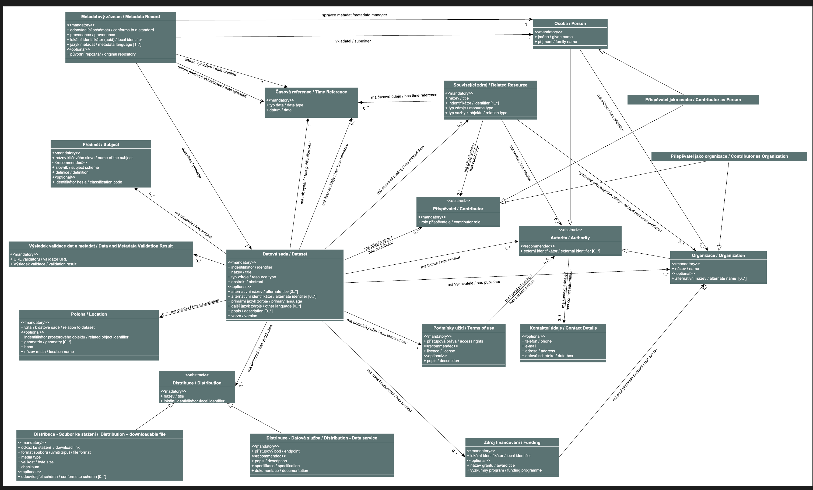

# Create a vocabulary based on Datacite (Voc1)
1. [DataCite Metadata Schema](https://schema.datacite.org/) is an XML standard. We need to create terms corresponding to this standard as an RDF vocabulary, so that we can create an AP from it.
   1. Create classes, attributes, relationships (English and Czech)
   2. Publish this as a vocabulary data specification

# Create a custom vocabulary for CCMM (Voc2)
1. Some terms may not be covered by Datacite nor DCAT-AP
   1. Create classes, attributes, relationships (English and Czech)
   2. Publish this as a vocabulary data specification

# Create a subset of DCAT-AP relevant for CCMM (AP1)
1. Empty AP
2. Import DCAT
3. Profile the relevant subset, update definitions with DCAT-AP definitions from https://semiceu.github.io/DCAT-AP/releases/3.0.0/ (English and Czech)
4. Publish as DCAT-AP spec

## CCMM Application profile
1. Create profile from
   1. DataCite vocabulary (Voc1)
   2. Custom vocabulary (Voc2)
   3. DCAT-AP (AP1) (NOTE: CAN WE DO THIS?) IF NOT, THEN DO DCAT-AP HERE DIRECTLY based on DCAT... we probably can when we select AP1 as the thing to be profiled
   4. (possibly parts of DCAT-AP-CZ) - that would be DCAT/DCAT-DAP/DCAT-AP/DCAT-AP-CZ chain of APs - here we now definitely cannot add another AP
2. It will look like:
   
3. Publish the AP for others to reuse
4. In the AP, go to Structural model creator
   1. Create a structure, export XSD, respec